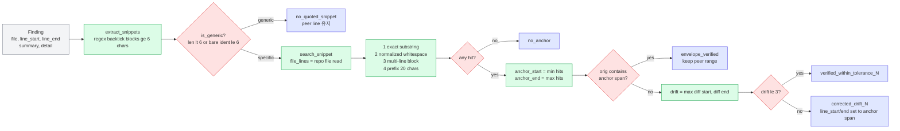
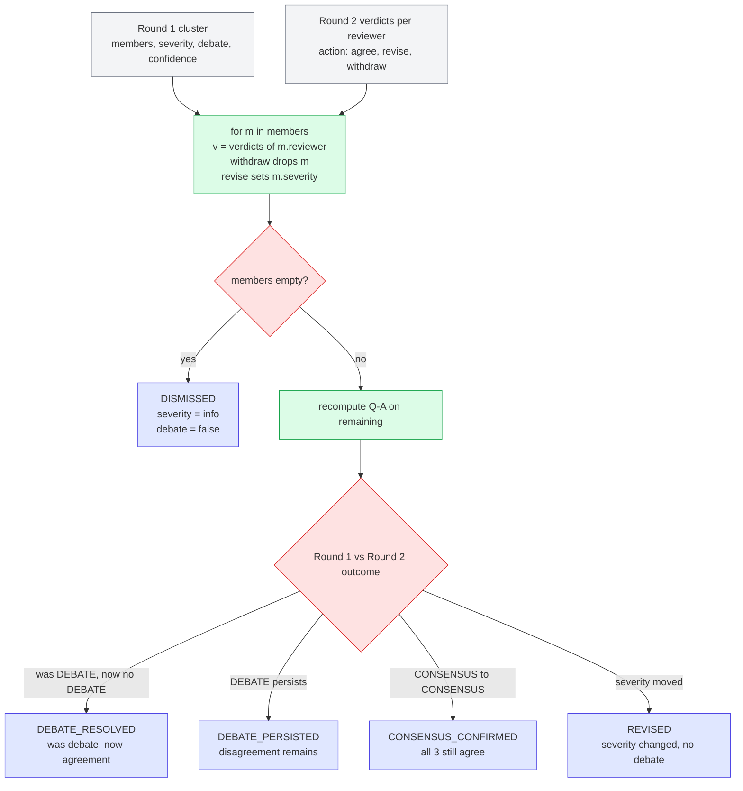
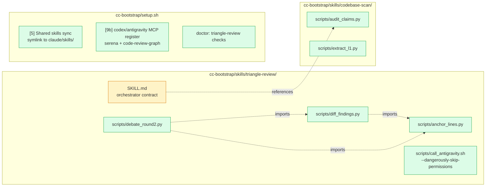

# Triangle Review — End-to-End Pipeline

3-way AI peer review (Claude + Codex + Antigravity) with mechanical consensus + selective multi-turn debate.

> **Migration note (2026-06-18)**: Gemini CLI 지원 종료에 따라 3rd peer 가 Gemini → Antigravity (`agy`) 로 교체. 산출물 파일명도 `gemini.json` → `antigravity.json`.

## 전체 파이프라인

```mermaid
flowchart TD
    User(["User: triangle-review TARGET"]):::input
    Target["TARGET<br/>repo path or diff or file glob"]:::input

    subgraph Phase01["Phase 0-1 · Setup and Shared Baseline"]
        direction TB
        P0["Phase 0<br/>git rev-parse, mkdir<br/>.claude/triangle-review/RUN_ID/"]:::orchestrator
        P1A["code-review-graph build"]:::script
        P1B["audit_claims.py --emit-evidence"]:::script
        L1["L1.json<br/>L1-facts.md<br/>L1-evidence.json"]:::evidence
        P0 --> P1A --> P1B --> L1
    end

    subgraph Phase2["Phase 2 · 3-Peer Parallel Spawn"]
        direction LR
        Claude["Claude (orchestrator)<br/>serena MCP<br/>code-review-graph MCP"]:::peer
        Codex["Codex<br/>mcp codex-mcp ask_codex<br/>bg job, reasoning_effort=medium"]:::peer
        Antigravity["Antigravity<br/>mcp antigravity-mcp ask_antigravity<br/>or call_antigravity.sh"]:::peer
    end

    L1 --> Claude
    L1 --> Codex
    L1 --> Antigravity
    Target --> Claude
    Target --> Codex
    Target --> Antigravity

    ClaudeJSON["claude.json<br/>findings list"]:::data
    CodexJSON["codex.json<br/>findings list"]:::data
    AntigravityJSON["antigravity.json<br/>findings list"]:::data
    Claude --> ClaudeJSON
    Codex --> CodexJSON
    Antigravity --> AntigravityJSON

    subgraph Anchor["Phase 3.5 · anchor_lines.py · Iteration 1"]
        direction TB
        Extract["extract_snippets<br/>backtick + triple-backtick"]:::script
        Search["search_snippet<br/>exact, normalized, multi-line, prefix"]:::script
        Decide{"envelope?<br/>orig contains hits"}:::decision
        Keep["envelope_verified<br/>keep peer range"]:::status
        Tol{"drift le 3?"}:::decision
        Verified["verified_within_tolerance"]:::status
        Corrected["corrected_drift_N<br/>line_start/end rewritten"]:::status
        Extract --> Search --> Decide
        Decide -- yes --> Keep
        Decide -- no --> Tol
        Tol -- yes --> Verified
        Tol -- no --> Corrected
    end

    ClaudeJSON --> Extract
    CodexJSON --> Extract
    AntigravityJSON --> Extract

    subgraph Consensus["Phase 4 · diff_findings.py · Q-A Consensus"]
        direction TB
        Cluster["cluster_findings<br/>key file + line overlap + category"]:::script
        Severity["resolve_severity<br/>unique S = single severity<br/>critical in S = critical + DEBATE<br/>else = max S + DEBATE"]:::script
        Classify["classify_cluster<br/>3 reviewers = CONSENSUS<br/>2 = MAJORITY, 1 = SINGLE"]:::script
        Cluster --> Severity --> Classify
    end

    Keep --> Cluster
    Verified --> Cluster
    Corrected --> Cluster

    Round1MD["CODE-REVIEW.md Round 1"]:::output
    Classify --> Round1MD

    DebateGate{"--debate flag?"}:::decision
    Round1MD --> DebateGate

    subgraph Debate["Phase 4.5 · debate_round2.py · Iteration 3 optional"]
        direction TB
        Prepare["prepare<br/>filter targets by mode<br/>disagreement = DEBATE only<br/>both = + CONSENSUS"]:::script
        Targets["targets.json<br/>round2_prompt.txt"]:::data
        Round2Spawn["3-peer Round 2 spawn<br/>Phase 2와 동일 메커니즘"]:::orchestrator
        Round2JSON["claude_round2.json<br/>codex_round2.json<br/>antigravity_round2.json"]:::data
        Merge["merge<br/>apply_verdicts per cluster<br/>action: agree, revise, withdraw"]:::script
        Status{"all members<br/>withdrew?"}:::decision
        Dismiss["DISMISSED · false alarm"]:::status
        Recompute["recompute Q-A severity<br/>DEBATE_RESOLVED<br/>DEBATE_PERSISTED<br/>CONSENSUS_CONFIRMED<br/>REVISED"]:::script
        Prepare --> Targets --> Round2Spawn --> Round2JSON --> Merge --> Status
        Status -- yes --> Dismiss
        Status -- no --> Recompute
    end

    DebateGate -- "skip default" --> FinalMD
    DebateGate -- "disagreement or both" --> Prepare
    Recompute --> FinalMD
    Dismiss --> FinalMD

    FinalMD["CODE-REVIEW.md final<br/>Round 2 annotated if applied"]:::output
    Report(["Report path to user"]):::input
    FinalMD --> Report

    classDef input fill:#e0f2fe,stroke:#0284c7,stroke-width:2px,color:#0c4a6e
    classDef orchestrator fill:#fef3c7,stroke:#d97706,stroke-width:2px,color:#78350f
    classDef peer fill:#fce7f3,stroke:#db2777,stroke-width:2px,color:#831843
    classDef script fill:#dcfce7,stroke:#16a34a,stroke-width:1.5px,color:#14532d
    classDef data fill:#f3f4f6,stroke:#6b7280,stroke-width:1px,color:#1f2937
    classDef evidence fill:#fef9c3,stroke:#ca8a04,stroke-width:1.5px,color:#713f12
    classDef output fill:#ede9fe,stroke:#7c3aed,stroke-width:2px,color:#4c1d95
    classDef decision fill:#fee2e2,stroke:#dc2626,stroke-width:1.5px,color:#7f1d1d
    classDef status fill:#e0e7ff,stroke:#4f46e5,stroke-width:1px,color:#312e81
```



---

## anchor_lines 알고리즘 상세



---

## debate_round2 — Round 2 verdict 적용



---

## 파일 ↔ 책임 매핑



---

## 검증된 효과 (ml-simplefold pilot, 2026-04-27)

| 단계 | Before | After | Δ |
|---|---|---|---|
| Line accuracy | 15% | **95%** | +80pp |
| Pure False Positive | 0/20 | 0/20 | 동일 |
| CONSENSUS clusters | 0 | 1 | anchor 적용으로 free win |
| Round 2 양방향 verdict 변경 | — | claude↓ minor, 3rd peer↑ critical | 입증 (당시 3rd peer는 gemini; 메커니즘 동일) |

## 사용 흐름 (한 줄 셋업 → 사용)

```bash
# 새 머신 셋업 (1회)
git clone https://github.com/Byun-jinyoung/cc-bootstrap.git ~/.cc-bootstrap
cd ~/.cc-bootstrap && ./setup.sh sync

# Triangle Review 실행 (기본 = Round 1만)
# Claude Code 안에서 "triangle review <target>" 트리거

# Round 2 추가 (선택)
debate_round2.py prepare --run-dir <dir> --repo <repo> --mode disagreement
# orchestrator가 3 peer 재spawn
debate_round2.py merge --run-dir <dir>
```
